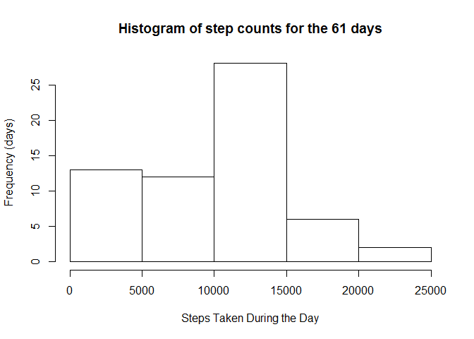
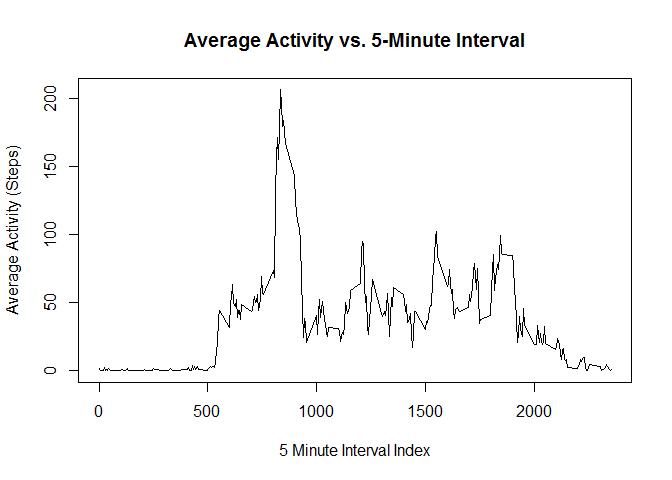
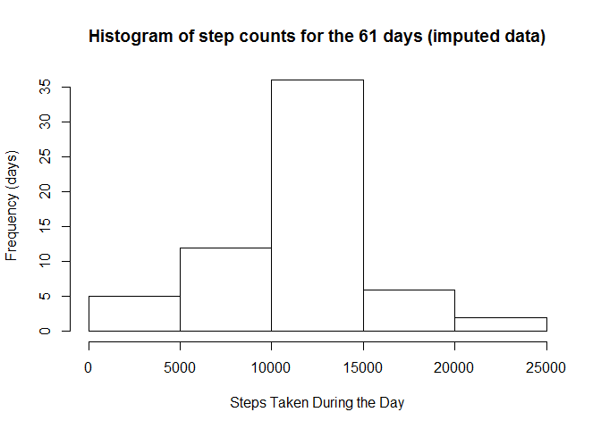
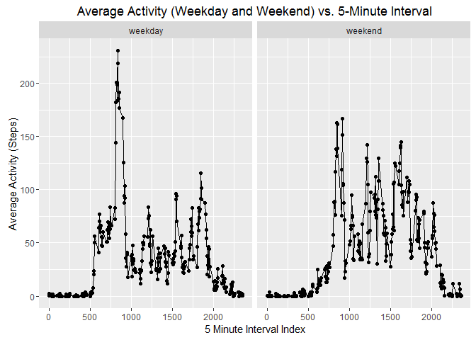

# Reproducible Research: Peer Assessment 1

This assignment involves reading in and performing simple exploratory 
analyses of 2 months of a single person's Fitbit data which 
consists of estimated counts of steps taken in each 5 minute interval 
during the 61 days (from October 1 to November 30 of 2012).  We look at 
both total daily activity (summed up step counts), and the average 
(across days) step counts for each 5 minute interval.  These can tell us 
something about the person's activity patterns during the 2 month period.

## Loading and preprocessing the data

First, we want to load the `dplyr` package so we can process the data 
more easily:


```r
library(dplyr)
```

The first step to actually processing the data is to unzip the 
`activity.zip` file:


```r
unzip("activity.zip")
```

This extracts the `activity.csv` file. 
We then want to read this file into a data frame, and I choose to reorder
the columns so that the observation ID variables (`date` and `interval`) 
are the first columns and the measurement variable (`steps`) is the last 
variable.


```r
dfr <- read.csv("activity.csv")
dfr <- select(dfr, date, interval, steps)
head(dfr)
```

```
##         date interval steps
## 1 2012-10-01        0    NA
## 2 2012-10-01        5    NA
## 3 2012-10-01       10    NA
## 4 2012-10-01       15    NA
## 5 2012-10-01       20    NA
## 6 2012-10-01       25    NA
```

```r
tail(dfr)
```

```
##             date interval steps
## 17563 2012-11-30     2330    NA
## 17564 2012-11-30     2335    NA
## 17565 2012-11-30     2340    NA
## 17566 2012-11-30     2345    NA
## 17567 2012-11-30     2350    NA
## 17568 2012-11-30     2355    NA
```

One peculiarity to note about the interval data is that the indices are 
non-uniformly defined.


```r
unique(dfr$interval)
```

```
##   [1]    0    5   10   15   20   25   30   35   40   45   50   55  100  105
##  [15]  110  115  120  125  130  135  140  145  150  155  200  205  210  215
##  [29]  220  225  230  235  240  245  250  255  300  305  310  315  320  325
##  [43]  330  335  340  345  350  355  400  405  410  415  420  425  430  435
##  [57]  440  445  450  455  500  505  510  515  520  525  530  535  540  545
##  [71]  550  555  600  605  610  615  620  625  630  635  640  645  650  655
##  [85]  700  705  710  715  720  725  730  735  740  745  750  755  800  805
##  [99]  810  815  820  825  830  835  840  845  850  855  900  905  910  915
## [113]  920  925  930  935  940  945  950  955 1000 1005 1010 1015 1020 1025
## [127] 1030 1035 1040 1045 1050 1055 1100 1105 1110 1115 1120 1125 1130 1135
## [141] 1140 1145 1150 1155 1200 1205 1210 1215 1220 1225 1230 1235 1240 1245
## [155] 1250 1255 1300 1305 1310 1315 1320 1325 1330 1335 1340 1345 1350 1355
## [169] 1400 1405 1410 1415 1420 1425 1430 1435 1440 1445 1450 1455 1500 1505
## [183] 1510 1515 1520 1525 1530 1535 1540 1545 1550 1555 1600 1605 1610 1615
## [197] 1620 1625 1630 1635 1640 1645 1650 1655 1700 1705 1710 1715 1720 1725
## [211] 1730 1735 1740 1745 1750 1755 1800 1805 1810 1815 1820 1825 1830 1835
## [225] 1840 1845 1850 1855 1900 1905 1910 1915 1920 1925 1930 1935 1940 1945
## [239] 1950 1955 2000 2005 2010 2015 2020 2025 2030 2035 2040 2045 2050 2055
## [253] 2100 2105 2110 2115 2120 2125 2130 2135 2140 2145 2150 2155 2200 2205
## [267] 2210 2215 2220 2225 2230 2235 2240 2245 2250 2255 2300 2305 2310 2315
## [281] 2320 2325 2330 2335 2340 2345 2350 2355
```

Hours begin on indices 0, 100,.. 2300, but the interval indices within each 
hour tell what the starting minute is (from 0-55) within the hour.

Now there are a couple of data aggregations we want to perform for our 
future analyses.  First, we want to pool by date and add up the steps for 
each day.


```r
daySteps <- group_by(dfr, date) %>% summarize(totalSteps=sum(steps, na.rm=TRUE))
head(data.frame(daySteps), 61)
```

```
##          date totalSteps
## 1  2012-10-01          0
## 2  2012-10-02        126
## 3  2012-10-03      11352
## 4  2012-10-04      12116
## 5  2012-10-05      13294
## 6  2012-10-06      15420
## 7  2012-10-07      11015
## 8  2012-10-08          0
## 9  2012-10-09      12811
## 10 2012-10-10       9900
## 11 2012-10-11      10304
## 12 2012-10-12      17382
## 13 2012-10-13      12426
## 14 2012-10-14      15098
## 15 2012-10-15      10139
## 16 2012-10-16      15084
## 17 2012-10-17      13452
## 18 2012-10-18      10056
## 19 2012-10-19      11829
## 20 2012-10-20      10395
## 21 2012-10-21       8821
## 22 2012-10-22      13460
## 23 2012-10-23       8918
## 24 2012-10-24       8355
## 25 2012-10-25       2492
## 26 2012-10-26       6778
## 27 2012-10-27      10119
## 28 2012-10-28      11458
## 29 2012-10-29       5018
## 30 2012-10-30       9819
## 31 2012-10-31      15414
## 32 2012-11-01          0
## 33 2012-11-02      10600
## 34 2012-11-03      10571
## 35 2012-11-04          0
## 36 2012-11-05      10439
## 37 2012-11-06       8334
## 38 2012-11-07      12883
## 39 2012-11-08       3219
## 40 2012-11-09          0
## 41 2012-11-10          0
## 42 2012-11-11      12608
## 43 2012-11-12      10765
## 44 2012-11-13       7336
## 45 2012-11-14          0
## 46 2012-11-15         41
## 47 2012-11-16       5441
## 48 2012-11-17      14339
## 49 2012-11-18      15110
## 50 2012-11-19       8841
## 51 2012-11-20       4472
## 52 2012-11-21      12787
## 53 2012-11-22      20427
## 54 2012-11-23      21194
## 55 2012-11-24      14478
## 56 2012-11-25      11834
## 57 2012-11-26      11162
## 58 2012-11-27      13646
## 59 2012-11-28      10183
## 60 2012-11-29       7047
## 61 2012-11-30          0
```

We should note that the days with missing data end up having step counts 
of 0.

Next we want to pool by the 5 minute interval index and average across all 
days, to give average step counts for each interval.


```r
intervalAveSteps <- group_by(dfr, interval) %>% summarize(aveSteps=mean(steps, na.rm=TRUE))
head(data.frame(intervalAveSteps))
```

```
##   interval  aveSteps
## 1        0 1.7169811
## 2        5 0.3396226
## 3       10 0.1320755
## 4       15 0.1509434
## 5       20 0.0754717
## 6       25 2.0943396
```

```r
tail(data.frame(intervalAveSteps))
```

```
##     interval  aveSteps
## 283     2330 2.6037736
## 284     2335 4.6981132
## 285     2340 3.3018868
## 286     2345 0.6415094
## 287     2350 0.2264151
## 288     2355 1.0754717
```

## What is mean total number of steps taken per day?

We want to start looking at statistics for the daily step counts and make 
a histogram of these to give us an idea how daily activity is distributed 
among the days.


```r
totStepsMean <- mean(daySteps$totalSteps)
totStepsMed <- median(daySteps$totalSteps)
hist(daySteps$totalSteps, main="Histogram of step counts for the 61 days", 
     xlab="Steps Taken During the Day", ylab="Frequency (days)")
```



The mean calculated for the daily sums is 9354.2295082 and the median 
is 10395.  This is skewed by a lot of data points with 
low step counts, which happen to include the days where data was missing.

## What is the average daily activity pattern?

We want to get an idea of the daily trend of activity averaged across all 
days.  The first two lines below find the 5 minute interval index for the 
interval where the average over days is maximum.  The plot, then, shows the 
average step counts vs. interval index.


```r
rowInd <- which(intervalAveSteps$aveSteps==max(intervalAveSteps$aveSteps))
maxStepInterval <- intervalAveSteps$interval[rowInd]
plot(intervalAveSteps$interval, intervalAveSteps$aveSteps, type="l", 
     main="Average Activity vs. 5-Minute Interval", 
     xlab="5 Minute Interval Index", ylab="Average Activity (Steps)")
```



The interval index at which the average count is maximized is 
835 (7:35-7:40 am). Activity appears to pick up after 
interval 500, 
which would correspond to 4 am, which suggests that this peak 
corresponds to the person waking up and starting their day.

## Imputing missing values

The previous analyses have treated the missing data, effectively, as if that 
data had 0 steps taken in the intervals.  This led to there being a number 
of days with a sum of 0 steps taken, which is entirely unrealistic and will 
skew the data.  So, we may want to fill in this data with some *imputed* 
values which are good "guesses" as to typical values that might have been 
seen had valid data been collected. 


There are 2304 data points (corresponding to 5 min intervals) where 
the data is missing.  Observation reveals that these are for 8 particular 
days, when data is missing.  (Perhaps the wearer did not wear their Fitbit 
during those days.)

I chose to use the 5 minute interval averages (across days) that the 
previous graph shows to serve as those default values during particular 
missing values.  In order to perform this imputation process, we create 
a new dataframe that merges the original data with the average counts. 
We then round these averages to the nearest integer, since step counts 
should take on integer values.  Then, for all of the NA step values, we 
copy over these new rounded values.  Finally, we sort the frame by date, 
then interval, and we pull out the columns we want.


```r
dfr.imp <- merge(dfr, intervalAveSteps, by.x="interval", by.y="interval")
dfr.imp <- mutate(dfr.imp, aveSteps=round(aveSteps))
dfr.imp[is.na(dfr.imp$steps), ]$steps <- dfr.imp[is.na(dfr.imp$steps), ]$aveSteps
dfr.imp <- arrange(dfr.imp, date, interval) %>% select(date, interval, steps)
head(dfr.imp)
```

```
##         date interval steps
## 1 2012-10-01        0     2
## 2 2012-10-01        5     0
## 3 2012-10-01       10     0
## 4 2012-10-01       15     0
## 5 2012-10-01       20     0
## 6 2012-10-01       25     2
```

```r
tail(dfr.imp)
```

```
##             date interval steps
## 17563 2012-11-30     2330     3
## 17564 2012-11-30     2335     5
## 17565 2012-11-30     2340     3
## 17566 2012-11-30     2345     1
## 17567 2012-11-30     2350     0
## 17568 2012-11-30     2355     1
```

As can be seen, the step values at the start and end of the table, that were 
originally NA, have now been filled in.

Now, as before, we can take this data and calculate step sums for each day.


```r
daySteps.imp <- group_by(dfr.imp, date) %>% summarize(totalSteps=sum(steps))
head(data.frame(daySteps.imp), 61)
```

```
##          date totalSteps
## 1  2012-10-01      10762
## 2  2012-10-02        126
## 3  2012-10-03      11352
## 4  2012-10-04      12116
## 5  2012-10-05      13294
## 6  2012-10-06      15420
## 7  2012-10-07      11015
## 8  2012-10-08      10762
## 9  2012-10-09      12811
## 10 2012-10-10       9900
## 11 2012-10-11      10304
## 12 2012-10-12      17382
## 13 2012-10-13      12426
## 14 2012-10-14      15098
## 15 2012-10-15      10139
## 16 2012-10-16      15084
## 17 2012-10-17      13452
## 18 2012-10-18      10056
## 19 2012-10-19      11829
## 20 2012-10-20      10395
## 21 2012-10-21       8821
## 22 2012-10-22      13460
## 23 2012-10-23       8918
## 24 2012-10-24       8355
## 25 2012-10-25       2492
## 26 2012-10-26       6778
## 27 2012-10-27      10119
## 28 2012-10-28      11458
## 29 2012-10-29       5018
## 30 2012-10-30       9819
## 31 2012-10-31      15414
## 32 2012-11-01      10762
## 33 2012-11-02      10600
## 34 2012-11-03      10571
## 35 2012-11-04      10762
## 36 2012-11-05      10439
## 37 2012-11-06       8334
## 38 2012-11-07      12883
## 39 2012-11-08       3219
## 40 2012-11-09      10762
## 41 2012-11-10      10762
## 42 2012-11-11      12608
## 43 2012-11-12      10765
## 44 2012-11-13       7336
## 45 2012-11-14      10762
## 46 2012-11-15         41
## 47 2012-11-16       5441
## 48 2012-11-17      14339
## 49 2012-11-18      15110
## 50 2012-11-19       8841
## 51 2012-11-20       4472
## 52 2012-11-21      12787
## 53 2012-11-22      20427
## 54 2012-11-23      21194
## 55 2012-11-24      14478
## 56 2012-11-25      11834
## 57 2012-11-26      11162
## 58 2012-11-27      13646
## 59 2012-11-28      10183
## 60 2012-11-29       7047
## 61 2012-11-30      10762
```

Now we calculate a new mean and median and plot a new histogram with this 
data.


```r
totStepsMean.imp <- mean(daySteps.imp$totalSteps)
totStepsMed.imp <- median(daySteps.imp$totalSteps)
hist(daySteps.imp$totalSteps, 
     main="Histogram of step counts for the 61 days (imputed data)", 
     xlab="Steps Taken During the Day", ylab="Frequency (days)")
```



The new mean calculated for the daily sums with the imputed data is 
1.0765639\times 10^{4} and the median is 1.0762\times 10^{4}. The mean has 
significantly increased and is now much closer to the median, which 
indicates an "unskewing" of the distribution. 
One of the first things to notice here is that 
the histogram is far more symmetric, i.e., less skewed, than the previous 
histogram that used the non-imputed missing data.  This illustrates the 
benefit of missing data imputation: you arrive at more realistic values 
that lead to more representative distributions.

## Are there differences in activity patterns between weekdays and weekends?

In the previous line plot, we viewed the average step count vs. interval 
index, with the data averaged over all days.  But what if we want to 
compare the averages on the weekday vs. the weekend?

First we calculate a new weekend variable to add to our (imputed) data. 
Then, we perform a new aggregation by groups that include both interval 
index and "weektime" (weekday vs. weekend), and we calculate averages for 
each of the groups.


```r
isWeekend <- weekdays(as.Date(as.character(dfr.imp$date))) %in% c("Saturday", "Sunday")
dfr.imp <- mutate(dfr.imp, weektime=factor(sapply(isWeekend, 
    function(x) {if (x) "weekend" else "weekday"})))
intervalWTAveSteps <- group_by(dfr.imp, interval, weektime) %>%
    summarize(aveSteps=mean(steps))
head(data.frame(intervalWTAveSteps))
```

```
##   interval weektime  aveSteps
## 1        0  weekday 2.2888889
## 2        0  weekend 0.2500000
## 3        5  weekday 0.4000000
## 4        5  weekend 0.0000000
## 5       10  weekday 0.1555556
## 6       10  weekend 0.0000000
```

```r
tail(data.frame(intervalWTAveSteps))
```

```
##     interval weektime  aveSteps
## 571     2345  weekday 0.3111111
## 572     2345  weekend 1.7500000
## 573     2350  weekday 0.2666667
## 574     2350  weekend 0.0000000
## 575     2355  weekday 1.4000000
## 576     2355  weekend 0.1250000
```

This data is organized in a way that is conducive to using ggplot to 
make a panel plot.  We plot two panels (weekday vs. weekend) and, for each 
of these, the average step count vs. the interval index.


```r
library(ggplot2)
qplot(interval, aveSteps, data=intervalWTAveSteps, facets=. ~ weektime, 
      geom=c("point", "line")) + 
    labs(title="Average Activity (Weekday and Weekend) vs. 5-Minute Interval") +
    labs(x="5 Minute Interval Index") + labs(y="Average Activity (Steps)")
```



Overall, there appears to be more (average) activity during certain parts 
of the day during weekdays than on the weekends (for example between 
intervals 500 and 1000). Since this corresponds to the time between 4 and 
9 am, one likely hypothesis is that the wearer is sleeping in late during 
the weekends.
